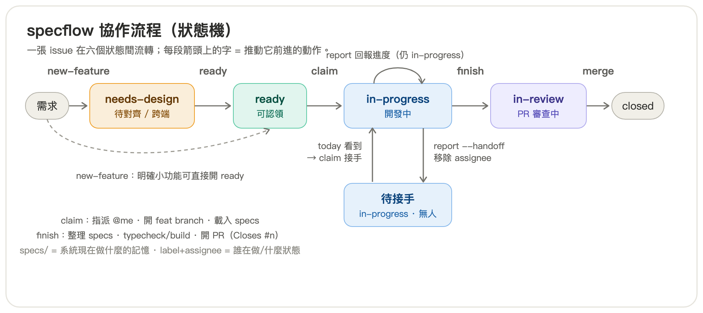

# specflow

一套**可跨專案引用**的協作流程，包成 Claude Code 插件。核心理念：

> **`specs/`** = 專案記憶（系統做什麼）· **GitHub Issue** = 輕量 TODO（這次做什麼）· **branch / PR / CI** = 程式碼與守門。
> 三層零重疊，狀態流轉一律經固定動作 —— 讓多人 / 多個 AI agent 能無痛接力同一專案。

## 為什麼用它

- **新 agent 接手不靠口頭交接**：靠 GitHub issue 的 `label + assignee` 當唯一真相，靠 `specs/` 當「系統現在做什麼」的記憶。`claim` 後讀 specs 就能上手，不必重掃 codebase。
- **記憶不腐壞**：CI `specs` job 擋下「改了行為卻沒更新 specs/」的 PR。
- **流程即程式**：六個動作是 slash command，也能用白話自然觸發（「叫後端補接口」→ 開卡；「我來接 #5」→ 認領）。

## 流程一覽（狀態機）



**「接任務」的兩個入口**（都走 `today` → `claim`）：

| 場景 | 怎麼接 |
|---|---|
| 接全新的卡 | `today` 列 `ready + 未指派` → `claim <n>` |
| 接別人交接的卡 | `today` 列 `in-progress + 無 assignee`（待接手）→ `claim <n>` |

## 動作（skill / 指令）

安裝後每個動作都可用 `/specflow:<name>` 呼叫，或用白話自然觸發：

| 動作 | 做什麼 |
|---|---|
| `new-feature` | 開一張輕量 issue（目標 / 要做什麼 / 驗收條件） |
| `ready` | 議定後把 `needs-design` 開放認領（→ `ready`） |
| `today` | 列今天可接的卡（全新可認領 + 待接手），依 `DEV_DOMAIN` 過濾 |
| `claim` | 認領：指派 + 轉 `in-progress` + 開 `feat/<n>-<slug>` + 載入 specs |
| `report` | 回報進度（commit/push/留言）；帶交接語意則移除 assignee |
| `finish` | 整理 specs → typecheck/build → 開 PR（`Closes #<n>`）→ 轉 `in-review` |
| `init` | **一次性**把新專案接上：建 labels、scaffold `specs/` / `CLAUDE.md` / specs CI 守門 |

外加一個 **SessionStart 簡報**：每次開工自動列出「協作流程提醒、`specs/` 有哪些記憶、有哪些卡可接」。

## 安裝

### 給團隊一起用（建議：透過 marketplace）

成員在自己的 Claude Code 執行（一次 add，之後 install）：

```
/plugin marketplace add swen-c/specflow
/plugin install specflow@specflow
```

往後流程有更新，成員用 `/plugin marketplace update specflow` 拉新版即可。

### 本機開發 / 試用（免安裝）

```bash
claude --plugin-dir /path/to/specflow/plugins/specflow
```

> 插件指令一律命名空間化為 `/specflow:<name>`（例 `/specflow:today`、`/specflow:claim 12`）。
> 白話也能觸發：「我來接 #5」→ claim、「叫後端補接口」→ new-feature、「收尾開 PR」→ finish。

## 新專案 30 秒接上

1. 安裝插件（見上）。
2. 在專案根目錄執行 `/specflow:init`，它會：
   - 建立 GitHub labels（`needs-design` / `ready` / `in-progress` / `in-review` / `no-spec`）。
   - 若無 `specs/` → scaffold `specs/README.md`。
   - 若無 `CLAUDE.md` → 從樣板複製，**請填好專案專屬處**（領域 label、各領域的 typecheck/build 指令）。
   - 提示把 `templates/ci-specs-gate.yml` 的 `specs` job 併入 CI，並在 repo 設為 required status check。
3. （選填）每人每台機器 `export DEV_DOMAIN=<領域>`（不要 commit），開工簡報與 `today` 會只顯示你領域的卡。

## 客製

- **改命令前綴**：把 `plugins/specflow/.claude-plugin/plugin.json` 與 `.claude-plugin/marketplace.json` 的 `name` 改成你要的（指令會跟著變成 `/<新名>:claim`）。
- **加領域分工**：在各專案的 `CLAUDE.md` 與 labels 自行定義（如 frontend/backend）；插件本身不綁死領域。
- **調 specs 格式 / CI**：改 `templates/specs-README.md`、`templates/ci-specs-gate.yml`。

## 授權

MIT，見 [LICENSE](LICENSE)。

## 結構

```
specflow/                                   ← 此 repo（同時是 marketplace）
├── .claude-plugin/marketplace.json
├── plugins/specflow/                       ← 插件本體
│   ├── .claude-plugin/plugin.json
│   ├── skills/{new-feature,ready,today,claim,report,finish,init}/SKILL.md
│   ├── hooks/{hooks.json,session-start.sh}
│   ├── rules/issue-template.md
│   └── templates/{CLAUDE.md.template,specs-README.md,ci-specs-gate.yml,setup-labels.sh}
└── README.md
```
